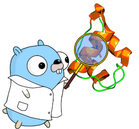

# goMD, a simple a tool for the analysis of MD trajectories.

This program makes extensive use of the goChem Computational Chemistry library.
If you use this program, we kindly ask you to support it by to citing the library as:

M. Dominguez, V.A. Jimenez, G. Savasci, R. Araya-Osorio, J. Pesonen and R. Mera-Adasme,  "goChem, a library for computational chemistry", http://www.gochem.org.

The gonum library (http://www.gonum.org/) is also much used (and appreciated).

goMD is a program that calculates  different parameters for each frame of a trajectory, printing the results to the standard output, to be plot against the frame number. It assumes very little about the structure, so both atomistic and coarse-grained (tested with Martini 3) are supported.

Plotting scripts are also included.

## Binary install

Download the package from the release page, uncompress it to the directory where you want the installation to be, and follow the indications in the INSTALL file in that directory.

## Source install
goMD works with the current release version of goChem. It also requires the silly chemical utils (github.com/rmera/scu) and, if XTC file format support is needed, the xdrfile library from Gromacs (www.gromacs.com). As it uses modules, you can simply use the following command:

```
go install github.com/rmera/gomd
```

To compile and install the program (compiling with XTC-trajectories support requires the xdrfile library installed, and the "xtc" compilation tag).

## Use

```
gomd [-skip=X -begin=Y] task molfilename trajname task_specific_arguments
```

The format of both the moleculefile (PDB, GRO and XYZ are supported) as well as that of the trajectory (DCD, multiPDB, multiXYZ,old-AMBER, and XTC are supported, XTC requires the xdrfile library), are determined by the respective file's extension. X and Y are integers.

### Tasks

goMD can perform several tasks, and it was designed so that the implementation of new tasks is rather simple. The task names are **not** case-sensitive. Most of the tasks obtain a value, or a group of values (an angle, a distance, an RMSD, Ramachandran angles) for one or mor given selections on each frame of the trajectory. A detailed explanation of each task is given in the Wiki. The current tasks are:

1. **Ramachandran**: Obtains Ramachandran angles for one or more selections, on each frame..
1. **RMSD**: Obtains the RMSD of the given selections vs the reference structure, on each frame.
1. **RMSF**: Obtains the RMSF (root-mean square fluctuation) of the atoms in the selection, along the trajectory.
1. **PerAtomRMSD**: Obtains the per-atom RSD of the given selections agains the reference PDB, on each frame.
1. **PerResidueRMSD**: Obtains the per-residue RSMD of the given chains agains the coordinates in the reference PDB, on each frame. 
1. **ClosestN**: Given a selection, obtains the distances for the closest N of an also given list of residue names to the selection, on each frame.
1. **WithinCutoff**: Similar to the previous but returns the number of residues of the types given, etc within a given distance of a selection, on each frame.
1. **RDF**: Similar to the previous but obtains the RDF (radial distribution function) or MDDF (minimal distance distribution function), depending on whether the selection contains one atom, or more, respectively, for residues of the given types, with respect to a given selection.
1. **Distance**: Obtains the distance between pairs of selections for each frame of the trajectory. 
1. **Angle**: Obtains the angle between triplets of consecutive selections selections, for each frame of the trajectory.  
	The number of given selections must be a multiple of 4. .  If a selection has more than one atom, the center of mass for that selection is used.
1. **Dihedral**: Obtains the dihedral angles between consecutive quadruplets of selections. 
1. **Shape**: Obtains the Planarity (oblate distortion) an Elongation (prolate distorion) percentages for the selections.
1. **PlanesAngle**: For every 2 selections, calculate the best plane passing through the atoms of each selection, and then returns the angles (in degrees) between the normal vector to each plane. An even number of selections must be given.
1. **FixGMX**: Will print a "fixed" version a Gromacs PDB, with the chains restored, and exit. 
1. **Super**: Superimposes the whole trajectory to the reference structure considering the atoms in selection to calculate the superposition. In order to employ the LOVO procedure, instead of defining a selection, use the *-lovo* option (see below).
1. **Average**: Prints the average structure over the trajectory
1. **InterByRes**: Takes 2 selections and, for each frame, obtains the ID for the residues in each selection that are part of the interface between both selections in that frame **This feature/task is experimental**.

### Lovo
* LOVO superposition calculation: While not strictly a task, goMD can employ LOVO ( 10.1371/journal.pone.0119264\n, 10.1186/1471-2105-8-306) to find the optimal atoms from a selection to superimpose. LOVO is invoked with the option _-lovo_ (More details in the Wiki)


### Selections: 
Most goMD tasks work in terms of goMD selections.

goMD selections are defined in the following way: "RESID1,RESID2,RESID3-RESID3+N,RESIDN CHAIN ATNAME1,ATNAME2"
RESID are residue numbers. They can be separated by commas or, to specify a range, with dashes: 12,13,120,125-128,145  The former would select the residues 12,13,120,125,126,127,128,145
CHAIN must be a chain identifier such as "A". If chain is "ALL", every chain will be used.
ATNAME is a PDB atom name such as CA (alpha carbon). Hydrogen names may vary with the forcefield employed. if ALL is given, as the first atom name, all atoms in the selected residues will be consiered.

## Plotting the results

A few Python scripts are included to help with the result visualization.
More information is given in the goMD wiki, and in each program's help.

1. ramachandran.py For Ramachandran angles.
1. interfaces.py plots the results of the InterByRes
1. plots.py for most other properties.
1. rdf2gomd.py A small program to put the results of the rdf task in a regular by-column goMD format, which can then be plotted with plots.py. The last line from the output of the _rdf_ task of goMD needs to be pasted in a file, which is then fed to this script.


## License

goMD, a little program for the analysis of molecular dynamics simulations.
Copyright (c) 2024  Raul Mera Adasme.

This program is free software; you can redistribute it and/or
modify it under the terms of the GNU General Public License
as published by the Free Software Foundation; either version 2
of the License, or (at your option) any later version.

This program is distributed in the hope that it will be useful,
but WITHOUT ANY WARRANTY; without even the implied warranty of
MERCHANTABILITY or FITNESS FOR A PARTICULAR PURPOSE.  See the
GNU General Public License for more details.

You should have received a copy of the GNU General Public License
along with this program; if not, write to the Free Software
Foundation, Inc., 51 Franklin Street, Fifth Floor, Boston, MA  02110-1301, USA.


Logo by Rocio Araya based on the Go Gopher artwork by Renee French, 
whom we gratefully acknowledge. 
the logo itself is under the same [CC-BY](https://creativecommons.org/licenses/by/4.0/) 
license as the original artwork.


The lead developer thanks ANID for financial support under 
Fondecyt N. 11160032 and N. 1200200

_To the long life of the Ven. Khenpo Phuntzok Tenzin Rinpoche._
